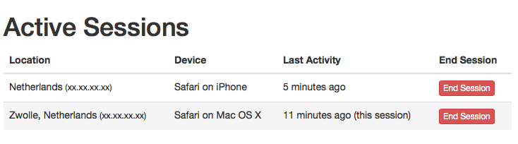
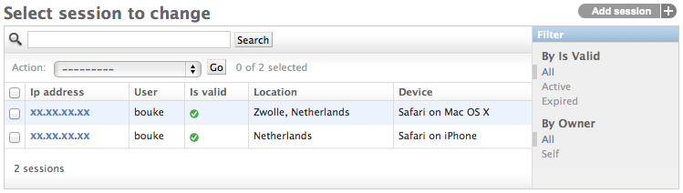

Usage
=====

Current session
---------------
The current session is available on the request, just like the normal session
middleware makes the session available::

    def my_view(request):
        request.session

All sessions
------------
To get the list of a user's sessions::

    sessions = user.session_set.filter(expire_date__gt=now())

You could logout the user everywhere::

    user.session_set.all().delete()

Generic views
-------------
There are two views included with this application, 
:class:`~user_sessions.views.SessionListView` and 
:class:`~user_sessions.views.SessionDeleteView`. Using this views you have a
simple, but effective, user session management that even looks great out of 
the box:

Template tags
~~~~~~~~~~~~~
Two template tags are included 
:meth:`~user_sessions.templatetags.user_sessions.device` and
:meth:`~user_sessions.templatetags.user_sessions.location`. These can be used
for respectively humanizing the user agent string and showing an approximate
location of the IP address::

    
    {{ session.user_agent|device }} -> Safari on OS X
    {{ session.ip|location }}       -> Zwolle, The Netherlands

Admin views
-----------

The user's IP address and user agent are also stored on the session. This
allows to show a list of active sessions to the user in the admin:

